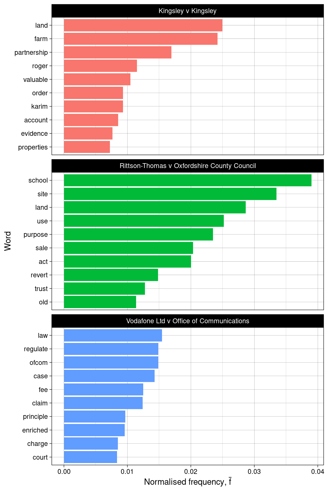
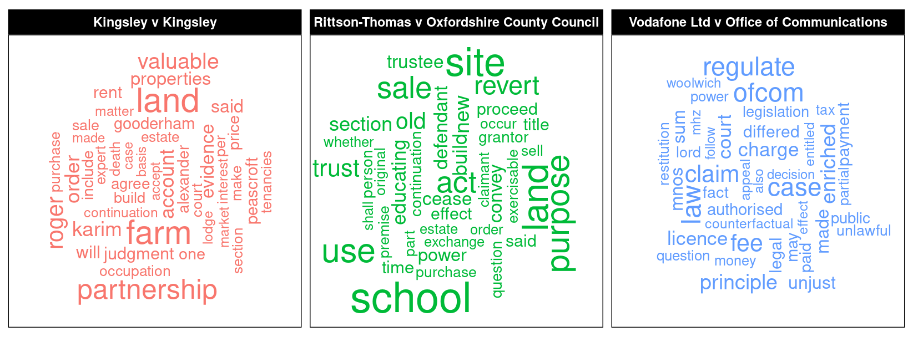
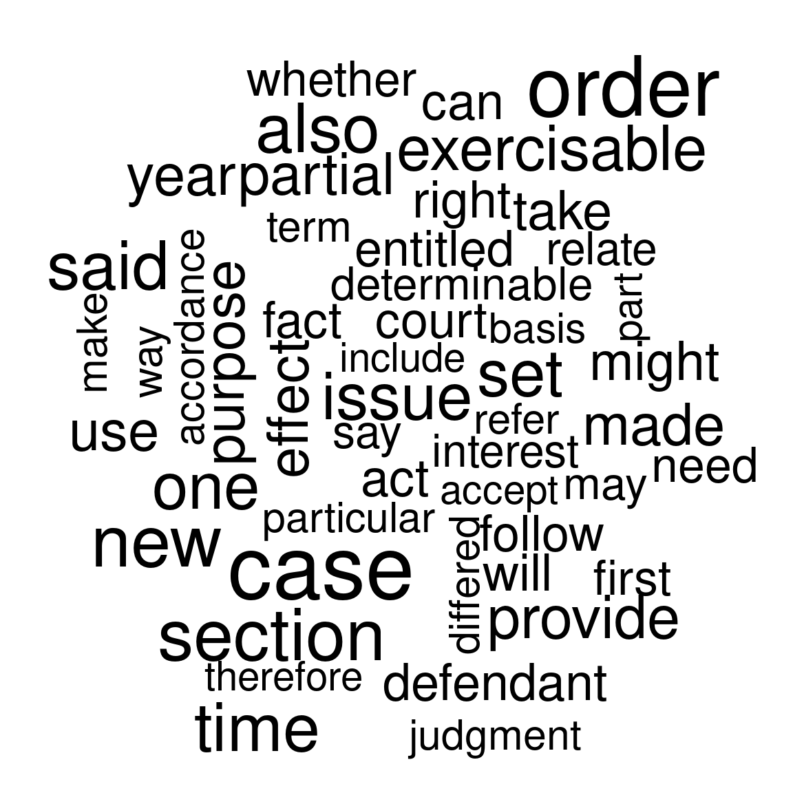
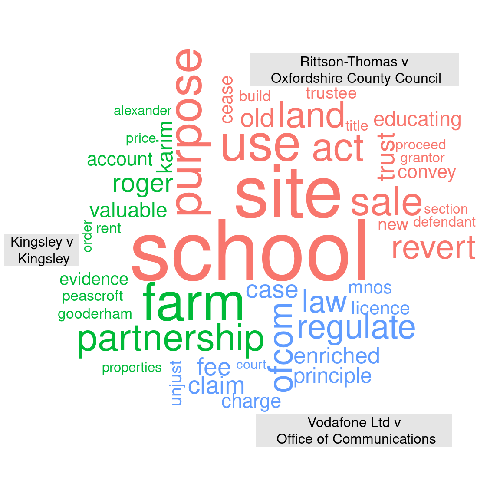

# Document Comparison with NLP


## Introduction

Herein, an example of applying NLP to legal proceedings will be demonstrated.  Legal documents are notoriously verbose and the objective will be to:

> Summarise, compare and contrast transcriptions of cases heard on the subject of 'Trust and Probate' in the High Court of Justice, London.

The transcriptions are publicly available via the [Incorporated Council of Law Reporting](https://www.iclr.co.uk/) in the form of PDF (Portable Document Format) documents.

## Read Document

The documents for analysis are described using JSON (JavaScript Object Notation) as follows:

```json
[
    {
        "name": "Rittson-Thomas v Oxfordshire County Council",
        "url": "https://www.iclr.co.uk/document/2018000552/transcriptXml_2018000552_2019031210462874/pdf/download",
        "use_fonts": [10, 13],
        "page_range": [2, "Inf"]
    },
    {
        "name": "Kingsley v Kingsley",
        "url": "https://www.iclr.co.uk/document/2019001209/transcriptXml_2019001209_2019092714065099/pdf/download",
        "use_fonts": [10, 13],
        "page_range": [2, "Inf"]
    },
    {
        "name": "Vodafone Ltd v Office of Communications",
        "url": "https://www.iclr.co.uk/document/2019001384/transcriptXml_2019001384_2019092714070160/pdf/download",
        "use_fonts": [10, 13],
        "page_range": [3, "Inf"]
    }
]
```


The fields in the JSON are:

* `name`: The name of the case
* `url`: The URL of the PDF document
* `use_fonts`: The font heights of the text that this to be processed
* `page_range`: The range of pages to process

Due to the nature of PDF documents, some preliminary inspection is required to determine the fonts size for the `use_fonts` field i.e. the text that contains the informative content rather than headers/footers, title, etc.  This inspection was performed using the `pdf_data` function from `pdftools` package [@R-pdftools].

A utility function (`extract_text`) is defined which takes the fields from the JSON objects as arguments and performs the necessary operations to download the PDF documents and extract the required text.  The utility function returns a `data.frame` with 2 columns:

* `doc_id`: name of the document.
* `text`: text for analysis.

The function utility function to each document using the `purrr::pmap_df` function [@R-purrr] resulting in a data frame with $N$ rows where $N$ is the number of documents.

For NLP, the `tm` package is used [@R-tm ; @tm2008].  The first stage of analysis is to source the documents and create a corpus object; this is then inspected as a sanity check.


```r
# Utility function for reading text specified by JSON.
extract_text <- function(name, url, use_fonts = NULL,
                         page_range = c(-Inf, Inf)) {

    # Download files to temporary location.
    destfile = tempfile(name, fileext = '.pdf')
    download.file(url = url, destfile = destfile, quiet = TRUE)

    # Filter pages/fonts of interest.
    text <- pdftools::pdf_data(destfile) %>%
        dplyr::bind_rows(.id = 'page') %>%
        dplyr::mutate(page = as.integer(page)) %>%
        dplyr::filter(between(page, page_range[1], page_range[2]))
    if (!is.null(use_fonts)) {
        text <- text %>% 
            dplyr::filter(height %in% use_fonts)
    }

    # Remove temporary files.
    unlink(destfile)

    # Return data frame of text.
    text <- text %>%
        dplyr::pull(text) %>%
        stringr::str_c(collapse = " ", sep = " ")
    data.frame(doc_id = name, text = text)
}

# Parse JSON text/file.
lst_spec <- jsonlite::fromJSON(json_spec)

# Read document texts to data frame.
df_text <- purrr::pmap_df(lst_spec, extract_text)

# Generate corpus.
corpus <- tm::DataframeSource(df_text) %>%
    tm::VCorpus()

# Inspect corpus.
corpus %>%
    purrr::map_chr(as.character) %>%
    purrr::map_chr(str_trunc, 500, 'center') %>%
    purrr::map_chr(str_wrap, 60) %>%
    cat(sep = '\n--------\n')
```

```
## Lord Justice Patten : 1. The School Sites Act 1841 (“the
## 1841 Act”) was passed in order to encourage and facilitate
## the provision of up to one acre of land for use as “a site
## for a school for the education of poor persons, or for the
## residence of th...ayground or for meals. But, in this case,
## the old site remained vacant with no further possible use
## for educational purposes. 24. I would therefore allow the
## appeal. Lord Justice Hamblen : 25. I agree. Lady Justice
## Nicola Davies : 26. I also agree.
## --------
## Lance Ashworth QC: Introduction 1. Because this case
## involves members of the same family, many of them share a
## surname. For the sake of clarity, I shall therefore, without
## intending any disrespect, refer to members of the Kingsley
## family by their gi...unable to agree this. At that hearing
## the parties may make further submissions as to any other
## matters arising out of the accounts for the Partnership as a
## consequence of this judgment and such other matters (if any)
## as cannot be agreed. 1 May 2019
## --------
## ADRIAN BELTRAMI QC: Introduction 1. This is the trial of
## four actions brought under CPR Part 8. The Claimant in
## each action is a Mobile Network Operator and I refer to
## them collectively as the MNOs and individually as Vodafone,
## Telefonica (or O2), H... it helpful, and indeed I think
## it positively unhelpful, for me to express views on these
## issues against a backdrop of conclusions that I have not
## reached. Determination 111. I give Judgment for the MNOs in
## the net sum claimed by each respectively.
```

## Tidy Corpus

The following transformations are applied to the corpus:

* Remove punctuation.
* Remove 'stop' words i.e. articles, pronouns and other common words conveying no information.
* Remove numbers.
* Reduce words to 'stems'.

The last operation, reducing words to 'stems', is worthy of some explanation.  Consider the words: 'regulate', 'regulation', 'regulatory'.  The word *stem* is 'regulat' i.e. the longest chain of common letters.  It is often appropriate to aggregate words using their stems for analysis, since the full words are likely to covey similar information in the context of the document.  After the transformations have been applied, the corpus is again inspected as a sanity check.


```r
# Pre-processing steps.
tidy_corpus <- corpus %>%
    tm::tm_map(tm::stripWhitespace) %>%
    tm::tm_map(tm::content_transformer(str_to_lower)) %>%
    tm::tm_map(tm::removePunctuation, ucp = TRUE) %>%
    tm::tm_map(tm::removeWords, c(tm::stopwords('english'), 'x', 'figure')) %>%
    tm::tm_map(tm::removeNumbers)

# Before stemming, take a copy of the original corpus to un-stem words later.
before_stem_corpus <- tidy_corpus
tidy_corpus %<>% tm::tm_map(stemDocument)

# Inspect tidy corpus.
tidy_corpus %>%
    purrr::map_chr(as.character) %>%
    purrr::map_chr(str_trunc, 500, 'center') %>%
    purrr::map_chr(str_wrap, 60) %>%
    cat(sep = '\n--------\n')
```

```
## lord justic patten school site act act pass order encourag
## facilit provis one acr land use site school educ poor person
## resid schoolmast schoolmistress otherwis purpos educ poor
## person religi use knowledg major case use provid land local
## church engl...e school use educ purpos requir activ use
## land educ children accept includ ancillari activ use site
## playground meal case old site remain vacant possibl use educ
## purpos therefor allow appeal lord justic hamblen agre ladi
## justic nicola davi also agre
## --------
## lanc ashworth qc introduct case involv member famili mani
## share surnam sake clariti shall therefor without intend
## disrespect refer member kingsley famili given name claim
## brought follow death june roger kingsley roger led automat
## dissolut farm partn...er agreement salli occupi peascroft
## andor peascroft matter conclus will list matter consequenti
## hear counsel can address form order follow parti unabl agre
## hear parti may make submiss matter aris account partnership
## consequ judgment matter agre may
## --------
## adrian beltrami qc introduct trial four action brought cpr
## part claimant action mobil network oper refer collect mnos
## individu vodafon telefonica o hutchison three ee materi
## distinct claim action save respect individu quantum relev
## mno defend case o...di event principl ladi kid appli event
## court appeal found breach eu law found mnos claim succeed
## none point aris determin consid help inde think posit unhelp
## express view issu backdrop conclus reach determin give
## judgment mnos net sum claim respect
```

## Analsysis

A *term-document* matrix (TDM) can now be constructed.  This is a matrix listing all words in the *corpus* (the superset of words in all documents) and the frequency with which they occur for each document.  Recall, that the processing is done on word *stems*.  Once the processing is complete, the stem is replaced with the most prevalent unstemmed word; this is so that when word clouds are generated later, natural English words are shown rather than stems.

In the chunk below, a TDM object is created and it is also transformed to a data frame for convenience.  Ten random rows of the term document data frame are shown below the code chunk.


```r
# Compute term document matrix.
tdm <- tm::TermDocumentMatrix(tidy_corpus)
tdm$dimnames$Terms <-tm::stemCompletion(tdm$dimnames$Terms,
                                        before_stem_corpus)

# Create term document data frame.
df_tdm <- tdm %>%
    as.matrix() %>%
    tibble::as_tibble(rownames = 'term') %>% 
    dplyr::filter(term != "")

# Output head/tail of TDM.
df_tdm %>% head()
df_tdm %>% tail()
```

```
## # A tibble: 6 x 4
##   term    `Rittson-Thomas v Oxfordsh… `Kingsley v King… `Vodafone Ltd v Office …
##   <chr>                         <dbl>             <dbl>                    <dbl>
## 1 aaron                             0                 2                        0
## 2 able                              1                10                       12
## 3 absence                           0                 0                        2
## 4 absent                            0                 0                        1
## 5 absolu…                           0                 4                        1
## 6 abuts                             0                 1                        0
## # A tibble: 6 x 4
##   term    `Rittson-Thomas v Oxfordsh… `Kingsley v King… `Vodafone Ltd v Office …
##   <chr>                         <dbl>             <dbl>                    <dbl>
## 1 yet                               0                 1                        4
## 2 yieldi…                           0                 0                        1
## 3 young                             1                 0                        0
## 4 younge…                           0                 1                        0
## 5 zealand                           0                 0                        1
## 6 zone                              0                 1                        0
```

## Exploratory Analysis

### Word Frequency

Figure \@ref(fig:plt-word-freq) shows the top words in each document as a bar plot.  The word frequencies have been normalised by computing the *term frequency*: 

$$
\mathrm{TF}_{i,j} = \frac{N_{i,j}}{\sum_{k=1}^{K} N_{k,j}}.
$$

$N_{i, j}$ denotes the word count for the $i$th word in the $j$th document and $K$ iterates through each word in document $j$.  The normalisation corrects for the fact that word frequencies would be expected to scale with the size of the document which would inflate the perceived importance of the word.

(ref:plt-word-freq) Bar plots of term frequencies.


```r
# Prepare plot data.
df_plt <- df_tdm %>%
    tidyr::pivot_longer(-term, names_to = 'document', values_to = 'freq') %>%
    dplyr::group_by(document) %>%
    dplyr::mutate(freq = freq / sum(freq)) %>%
    dplyr::top_n(n = 10, wt = freq) %>%
    dplyr::mutate(term = tidytext::reorder_within(term, freq, document))

# Create plot.
ggplot2::ggplot(df_plt, aes(x = term, y = freq, fill = document)) +
    ggplot2::geom_col() +
    ggplot2::coord_flip() +
    ggplot2::labs(
         x = 'Word',
         y = latex2exp::TeX('Normalised frequency, $\\bar{f}$')) +
    tidytext::scale_x_reordered() +
    ggplot2::facet_wrap(~document, ncol = 1, scales = 'free_y') +
    ggplot2::scale_fill_discrete(guide=FALSE) +
    ggplot2::theme_linedraw()
```

<div class="figure" style="text-align: center">

<p class="caption">(\#fig:plt-word-freq)(ref:plt-word-freq)</p>
</div>
An alternative way to present this information is as a *wordcloud*, as shown in figure \@ref(fig:plt-wordcloud).  Here, the word frequency is mapped to the size of the word depicted in the cloud.  

(ref:plt-wordcloud) Word cloud for each document.


```r
# Prepare plot data.
set.seed(42)
df_plt <- df_tdm %>%
    tidyr::pivot_longer(-term, names_to = 'document', values_to = 'freq') %>%
    dplyr::group_by(document) %>%
    dplyr::mutate(freq = freq / sum(freq)) %>%
    dplyr::top_n(n = 40, wt = freq) %>% 
    mutate(angle = 90 * sample(c(0, 1), n(), replace = TRUE, prob = c(60, 40))) 
    
# Create plot. 
ggplot2::ggplot(df_plt, aes(label = term, size = freq, angle=angle,
                            colour = document)) +
    ggwordcloud::geom_text_wordcloud(eccentricity=1) +
    ggplot2::coord_equal() +
    ggplot2::facet_wrap(~document, ncol = 3) +
    ggplot2::scale_size_area(max_size = 10) +
    ggplot2::theme_linedraw()
```

<div class="figure" style="text-align: center">

<p class="caption">(\#fig:plt-wordcloud)(ref:plt-wordcloud)</p>
</div>

These visualisations give a good idea of the keywords associated with each document.

### Commonality Cloud

Figure \@ref(fig:plt-commonality-cloud) shows plots a *commonality cloud*; this is the combined word cloud for the entire corpus where each term is normalised by the document word count.  Therefore, the commonality cloud depicts words that are *common* across all documents in the corpus.  The commonality cloud is plotted using the `wordcloud` package [@R-wordcloud].

(ref:plt-commonality-cloud) Commonality cloud.


```r
mat_plt <- as.matrix(tdm)
wordcloud::commonality.cloud(mat_plt, max.words = 50) 
```

<div class="figure" style="text-align: center">

<p class="caption">(\#fig:plt-commonality-cloud)(ref:plt-commonality-cloud)</p>
</div>

The common words identified seem reasonable; the majority relate to general vocabulary that would be expected in legal proceedings.

### Comparison Cloud

Figure \@ref(fig:plt-comparison-cloud) shows a *comparison cloud*.  Contrary to the *commonality* cloud empathising *similarities*, the *comparison* cloud emphasises *differences* in.  Let $f_{i,j}$ be the frequency of word $i$ in document $j$ and let $\bar{p}_i$ be the average frequency of word $i$ in the corpus i.e.

$$
\bar{p}_i = \frac{1}{J}\sum_{j=1}^{J} f_{i,j}.
$$

where $J$ number of documents in the corpus.  Then, in the *comparison cloud*, the size of of the word is mapped to the maximum deviation i.e. $\max_i(p_{i,j}-\bar{p}_i)$ and the position corresponds to the document in which the maximum occurs.  In other words, the words shown are cases where a particular document contains many instances of the word whereas the other documents do not.  The comparison cloud is plotted using the `wordcloud` package [@R-wordcloud].

(ref:plt-comparison-cloud) Comparison cloud.


```r
mat_plt <- as.matrix(tdm)

# Compute colour scheme to match ggplot.
gg_color_hue <- function(n) {
  hues = seq(15, 375, length = n + 1)
  hcl(h = hues, l = 65, c = 100)[1:n]
}
colors = gg_color_hue(3)

# Plot comparison cloud.
colnames(mat_plt) <- colnames(mat_plt) %>% str_replace("v", "v\n")
wordcloud::comparison.cloud(mat_plt, scale = c(6, .2),
                            colors = colors, max.words = 50,
                            title.size = 1)
```

<div class="figure" style="text-align: center">

<p class="caption">(\#fig:plt-comparison-cloud)(ref:plt-comparison-cloud)</p>
</div>

This analysis is consistent with the keywords derived from the word frequency analysis, however, keywords that are common between documents are suppressed i.e. are either not shown or are relatively smaller in size.
