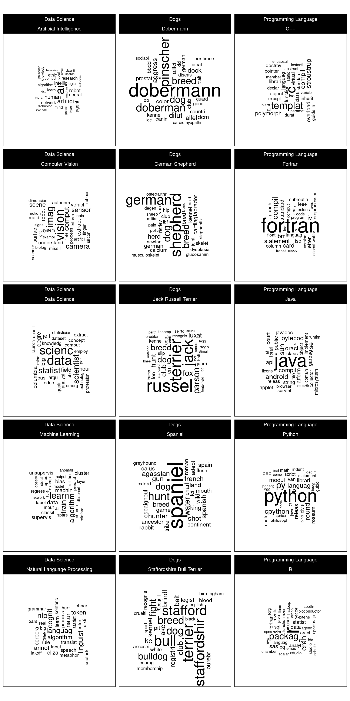
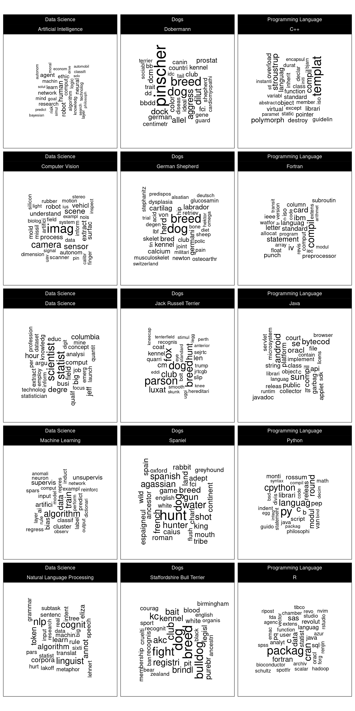
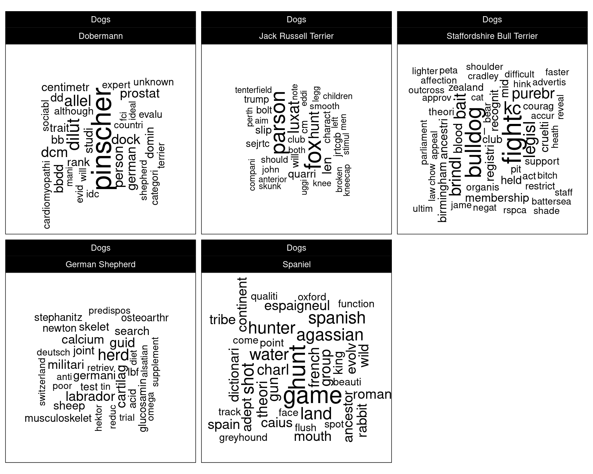

# Website Comparison with NLP


## Introduction

The aim in this analysis is to:

> Summarise the content of websites using NLP.

The analysis will consider [Wikipedia](https://www.wikipedia.org/) pages for the purpose of demonstration and in particular will demonstrate the usefulness of the *term frequency inverse document frequency* ($\mathrm{TFIDF}$) metric for NLP.

## Web Scraping

In this analysis, 15 Wikipedia web pages are considered.  Web scraping is an activity which should be performed with courtesy.  Often, a website will have a `robots.txt` file at its root page which sets out what is and is not acceptable.  Wikipedia's is here:

https://en.wikipedia.org/robots.txt

Upon inspection of this file, it is stated that:

> Friendly, low-speed bots are welcome viewing article pages, but not dynamically-generated pages please.

This confirms that automated requests to Wikipedia are acceptable but should be maintained at a courteous speed.  The Wikipedia pages that are to be scraped are as follows:


```r
# List of Wikipedia pages.
BASE_URL <- "https://en.wikipedia.org/wiki/"
subject <- list(
    # Data Science ----------------------------------------------------
    `Natural Language Processing`  = "Natural_Language_Processing",
    `Data Science`                 = "Data_science",
    `Computer Vision`              =  "Computer_vision",
    `Artificial Intelligence`      = "Artificial_intelligence",
    `Machine Learning`             = "Machine_learning",
    # Programming Languages -------------------------------------------
    `R`                            = "R_(programming_language)",
    `Python`                       = "Python_(programming_language)",
    `C++`                          = "C%2B%2B",
    `Fortran`                      = "Fortran",
    `Java`                         = "Java_(programming_language)",
    # Dogs ------------------------------------------------------------
    `German Shepherd`              = "German_Shepherd",
    `Spaniel`                      = "Spaniel",
    `Jack Russell Terrier`         = "Jack_Russell_Terrier",
    `Staffordshire Bull Terrier`   = "Staffordshire_Bull_Terrier",
    `Dobermann`                    = "Doberman_Pinscher"
)
```

Web pages are parsed using the `xml2` package [@R-xml2] and then the `rvest` [@R-rvest] package is used to extract the text content enclosed in `<p>` tags.  Furthermore, child tags of the `<p>` tags with a class attribute that corresponds to maths content are removed since these do not contain 'natural language'.


```r
# Utility function to scrape paragraph content from web pages.
scrape <- function(x, i) {
    # Courtesy delay.
    Sys.sleep(5)
    message(glue::glue("Scraping page for: {i}"))

    # Parse html.
    html_doc <- xml2::read_html(paste0(BASE_URL, x))

    # Get rid of nodes that contain maths.
    html_doc %>%
        rvest::html_nodes(css = "span[class^='mwe-math']") %>%
        xml2::xml_remove()

    # Extract text from nodes.
    text <- html_doc %>%
        rvest::html_nodes(css = 'p') %>%
        rvest::html_text() %>%
        stringr::str_c(collapse = " ") %>%
        stringr::str_squish() %>%
        stringr::str_replace_all("([a-z])([A-Z])", "\\1 \\2")

    # Return a data frame.
    tibble::tibble(doc_id = i, text = text)
}

# Iterate through each web page.
df_html <- purrr::imap_dfr(subject, scrape)
```

An example of the text parsed for the first document is shown below.  The reader may refer to the following web page to verify that the parsed text corresponds to the main web page text:

> https://en.wikipedia.org/wiki/Natural_Language_Processing


```r
df_html %>%
    dplyr::slice(1) %>%
    dplyr::pull(text) %>%
    stringr::str_trunc(800, 'center', ellipsis = '\n...\n') %>%
    stringr::str_wrap() %>%
    cat()
```

```
Natural language processing (NLP) is a subfield of linguistics, computer
science, information engineering, and artificial intelligence concerned with the
interactions between computers and human (natural) languages, in particular how
to program computers to process and analyze large amounts of natural language
data. Challenges in natural language processing frequently involve speech
recognition, ... n US patent 9269353 : Where, RMM, is the Relative Measure
of Meaning token, is any block of text, sentence, phrase or word N, is the
number of tokens being analyzed PMM, is the Probable Measure of Meaning based
on a corpora n, is one less than the number of tokens being analyzed d, is the
location of the token along the sequence of n tokens PF, is the Probability
Function specific to a language
```

## Tokenisation

The content of the webpages is processed as follows:

* Scraped text is tokenised to single words using `tidytext::unnest_tokens` [@R-tidytext ; @tidytext2016]; words are automatically converted to lower-case.
* Words which do not solely consist of ASCII alphabetical characters are removed.
* Words are converted to word stems using `tm::stemDocument` [@R-tm].
* The documents are categorised as *data science*, *programming language* or *dogs*; this is is to assist with later visualisation and analysis.

Stop words are not removed since the $\mathrm{TFIDF}$ (term-frequency inverse document-frequency) will be used to quantify the importance of a word (see \@ref(ssec:tfidf)); this will act to suppress or eliminate stop words.  The tokenised corpus is represented by a data frame and the first rows are shown for inspection below.


```r
df_tokens <- df_html %>%
    tidytext::unnest_tokens(word, text) %>%
    dplyr::filter(stringr::str_detect(word, '^[a-z]+$')) %>%
    dplyr::mutate(word = tm::stemDocument(word)) %>%
    dplyr::mutate(doc_class = case_when(
        doc_id %in% names(subject)[1:5] ~ "Data Science",
        doc_id %in% names(subject)[6:10] ~ "Programming Language",
        TRUE ~ "Dogs"
    )) %>%
    dplyr::select(doc_class, doc_id, word)

df_tokens %>% head()
```

```
## # A tibble: 6 x 3
##   doc_class    doc_id                      word   
##   <chr>        <chr>                       <chr>  
## 1 Data Science Natural Language Processing natur  
## 2 Data Science Natural Language Processing languag
## 3 Data Science Natural Language Processing process
## 4 Data Science Natural Language Processing nlp    
## 5 Data Science Natural Language Processing is     
## 6 Data Science Natural Language Processing a
```

## Term-frequency Inverse Document-Frequency {#ssec:tfidf}

Let $N_{i, j}$ denote the word count for the $i$th word in the $j$th document.  The the *term frequency*, $\mathrm{TF}$, for the $i$th word in the $j$th document is given by:

$$
\mathrm{TF}_{i,j} = \frac{N_{i,j}}{\sum_{k=1}^{K} N_{k,j}}
$$
where $k$ iterates through every word in the $j$th document.  The *term frequency* is therefore the word frequency in the document normalised with respect to the total word count for the document; in other words, it is the the proportion of the document made comprised of the $i$th word.

The *term frequency* might be considered as a measure of the *importance* of a word in a document; however, words that are *generally* important in language, such as stop words, will score highly.  Similarly, if a group of documents with a common theme are to be distinguished from each other, certain words will carry less information that is specific to a document.  For example, the word 'computer' may be common in documents relating to 'programming languages', hence it coveys information about the general theme but not about a specific document within that theme.  The *inverse document frequency*, $\mathrm{IDF}$, is a metric which mitigates this:

$$
\mathrm{IDF}_{i} = \ln \left[
    \frac{\sum_{j=1}^{J}j}
    {\sum_{j=1}^J \min \left(1, \sum_{j=1}^{J}N_{i,j} \right)}
\right]
$$

The $\mathrm{IDF}$ is the natural logarithm of ratio of the total number of documents to the number of documents containing word $i$.  Therefore, if word $i$ occurs in all documents, the $\mathrm{IDF}$ is 0 and the $\mathrm{IDF}$ increases as the word rarity word increases.  Note that the logarithmic relationship is derived from empirical studies of word importance ranking relative to natural language.

The product of $\mathrm{TF}$ and $\mathrm{IDF}$ is a common metric to measure the importance of a word.  The $\mathrm{IDF}$ acts to diminish the $\mathrm{TF}$ metric for words which are generally common in the corpus.  Hence, the *term-frequency inverse document-frequency* is often a useful metric for ranking *distinctive* words in a document.  The $\mathrm{TFIDF}$ metric is calculated using `tidytext::bind_tf_idf` [@R-tidytext].


```r
df_tf_idf <- df_tokens %>%
    dplyr::group_by(doc_class, doc_id) %>%
    dplyr::count(word, sort = TRUE) %>%
    dplyr::ungroup() %>%
    tidytext::bind_tf_idf(word, doc_id, n)
```

Below, the metrics for the words with the lowest and highest $\mathrm{TFIDF}$ are shown.  The word count 'the' is very common in each document i.e. $n$ is large.  However, the $\mathrm{IDF}$ is 0 since it occurs in all documents, thus $\mathrm{TFIDF}$ is also 0.  On the contrary, the word 'dobermann' has relatively few counts in the document on Dobermann but since it does not occur in other documents, it has a high $\mathrm{IDF}$ i.e. $\mathrm{IDF} = ln(15/1) = 2.71$.


```
## Lowest TFIDF...
```

```
## # A tibble: 6 x 7
##   doc_class            doc_id                  word      n     tf   idf tf_idf
##   <chr>                <chr>                   <chr> <int>  <dbl> <dbl>  <dbl>
## 1 Data Science         Artificial Intelligence the     679 0.0491     0      0
## 2 Data Science         Artificial Intelligence of      461 0.0334     0      0
## 3 Data Science         Artificial Intelligence to      431 0.0312     0      0
## 4 Data Science         Artificial Intelligence and     406 0.0294     0      0
## 5 Dogs                 Jack Russell Terrier    the     330 0.0821     0      0
## 6 Programming Language Fortran                 the     326 0.0605     0      0
```

```
## Highest TFIDF...
```

```
## # A tibble: 6 x 7
##   doc_class            doc_id    word          n     tf   idf tf_idf
##   <chr>                <chr>     <chr>     <int>  <dbl> <dbl>  <dbl>
## 1 Programming Language Python    python      141 0.0390  1.32 0.0515
## 2 Programming Language Java      java        163 0.0411  1.32 0.0543
## 3 Dogs                 Dobermann dobermann    56 0.0201  2.71 0.0545
## 4 Programming Language Fortran   fortran     183 0.0340  2.01 0.0684
## 5 Dogs                 Spaniel   spaniel      37 0.0373  2.01 0.0751
## 6 Programming Language R         r           107 0.0523  1.61 0.0842
```

## Exploratory Analysis

The word clouds for the $\mathrm{TFIDF}$ of each document are shown in figure \@ref(fig:plt-wordcloud-with-tw).  The word cloud data source is a corpus which does *not* explicitly convey the title of the document.  Notice how the highest scoring words based on $\mathrm{TFIDF}$ enable a good estimate of the likely title words.

(ref:plt-wordcloud-with-tw) Word clouds faceted by document categories.


```r
# Utility function to plot word cloud.
plot_word_cloud <- function(df, max_size) {
    # Prepare data.
    df_plt <- df %>%
        dplyr::group_by(doc_class, doc_id) %>%
        dplyr::top_n(30, wt = tf_idf) %>%
        dplyr::mutate(angle = 90 * sample(c(0, 1), n(), replace = TRUE,
                                          prob = c(60, 40)))

    # Create plot
    ggplot(df_plt, aes(label = word, size = tf_idf, angle = angle)) +
        ggwordcloud::geom_text_wordcloud(seed = 42, eccentricity = 1,
                                         shape = 'square') +
        ggplot2::scale_size_area(max_size = max_size) +
        ggplot2::coord_equal() +
        ggplot2::facet_wrap(~doc_class + doc_id, dir = 'v', ncol = 3) +
        ggplot2::theme_linedraw()
}

# Plot word cloud.
plot_word_cloud(df_tf_idf, max_size = 14)
```

<div class="figure" style="text-align: center">

<p class="caption">(\#fig:plt-wordcloud-with-tw)(ref:plt-wordcloud-with-tw)</p>
</div>

It is also insightful to remove the title words and recalculate the $\mathrm{TFIDF}$ word cloud.  The title words tend to overwhelm the other distinctive i.e. information-carrying words.  The resulting word cloud is shown in figure \@ref(fig:plt-wordcloud-no-tw).

(ref:plt-wordcloud-no-tw) Word clouds faceted by document categories with title document title words removed from the corpus.


```r
# Utility function to remove stemmed title words.
eliminate_words <- function(title) {
    stringr::str_split(title, " ")[[1]] %>%
        tm::stemDocument() %>%
        stringr::str_to_lower()
}

df_tf_idf_no_tw <- df_tokens %>%
    dplyr::group_by(doc_id) %>%
    # Eliminate title words.
    dplyr::filter(!(word %in% eliminate_words(doc_id))) %>%
    # Remove acronyms and misspellings.
    dplyr::filter(!(doc_id == 'C++' & word == 'c')) %>%
    dplyr::filter(!(doc_id == 'Dobermann' & word == 'doberman')) %>%
    dplyr::filter(
        !(doc_id == 'Staffordshire Bull Terrier' & word == 'stafford')) %>%
    dplyr::filter(!(doc_id == 'Artificial Intelligence' & word == 'ai')) %>%
    dplyr::ungroup() %>%
    # Compute TFIDF
    dplyr::group_by(doc_class, doc_id) %>%
    dplyr::count(word, sort = TRUE) %>%
    dplyr::ungroup() %>%
    tidytext::bind_tf_idf(word, doc_id, n)

# Plot word cloud
plot_word_cloud(df_tf_idf_no_tw, max_size = 10)
```

<div class="figure" style="text-align: center">

<p class="caption">(\#fig:plt-wordcloud-no-tw)(ref:plt-wordcloud-no-tw)</p>
</div>

From figure \@ref(fig:plt-wordcloud-no-tw) the high scoring words seem consistent with experience in these subjects and this confirms that the $\mathrm{TFIDF}$ metric is a useful indicator of the words that best describe what is distinctive about the contents of a document.

Notice that the word 'dog' is significant for each of the 5 pages relating to dogs.  This is to be expected since the word 'dog' is not a generally significant word for the 15 document corpus but *is* significant for these 5 articles.  Therefore, the $\mathrm{TFIDF}$ is relatively large.  To demonstrate the usefulness of the $\textrm{TFIDF}$ metric, it will be recalculated for *only* the dog articles.  The resulting word cloud is shown in figure \@ref{fig:plt-wordcloud-dogs}.  It is observed that the word 'dog' is eliminated since although the absolute count of the word for each document has not changed, it is now common to all documents, hence the $\mathrm{IDF}$ is 0.

(ref:plt-wordcloud-dogs) Word clouds for documents relating to dogs.


```r
df_tf_idf_dogs <- df_tokens %>%
    dplyr::filter(doc_class == 'Dogs') %>%
    dplyr::group_by(doc_class, doc_id) %>%
    dplyr::count(word, sort = TRUE) %>%
    dplyr::filter(!(word %in% eliminate_words(doc_id))) %>%
    dplyr::filter(!(doc_id == 'Dobermann' & word == 'doberman')) %>%
    dplyr::filter(
        !(doc_id == 'Staffordshire Bull Terrier' & word == 'stafford')) %>%
    dplyr::ungroup() %>%
    tidytext::bind_tf_idf(word, doc_id, n)

plot_word_cloud(df_tf_idf_dogs, max_size = 10)
```

<div class="figure" style="text-align: center">

<p class="caption">(\#fig:plt-wordcloud-dogs)(ref:plt-wordcloud-dogs)</p>
</div>
